# FIAP - Faculdade de Informática e Administração Paulista

<p align="center">
<a href= "https://www.fiap.com.br/"></a>
</p>

<br>

# CardioIA — Fase 1: Batimentos de Dados

## Grupo AI4Success - Turma 2TIAOA

## 👨‍🎓 Integrantes:
- <a href="https://www.linkedin.com/in/durval-dorta-junior-585311202/">Durval de Oliveira Dorta Junior - RM567007</a>
- Murilo Ferreira Borges - RM567738
- Guilherme Cury - RM564011
- Guilherme da Nobrega Gontijo - RM562211
- Estevao Ferreira Santos - RM567522

## 👩‍🏫 Professores:
### Tutor(a)
- Leonardo Ruiz Orabona
### Coordenador(a)
- <a href="https://www.linkedin.com/in/andregodoi/">Andre Godoi Chiovato</a>

## 📜 Descrição

O **CardioIA** é uma plataforma digital inteligente que simula o ecossistema de uma cardiologia moderna, integrando dados clínicos, Machine Learning, Visão Computacional, IoT e agentes inteligentes para triagem, diagnóstico, monitoramento e assistência remota.

Esta **Fase 1 — Batimentos de Dados** é a camada de aquisição do projeto. O grupo assume o papel de cientista de dados hospitalar e entrega três bases que alimentarão os módulos das fases seguintes: dados **numéricos** (exames cardiológicos e telemetria de vestíveis), **textuais** (literatura científica e comunicação de saúde pública) e **visuais** (eletrocardiogramas rotulados).

O problema justifica a escala: segundo o Ministério da Saúde, o Brasil registra de **300 a 400 mil infartos por ano**, com **um óbito a cada 5 a 7 casos**. A janela de decisão é de minutos, e a leitura de ECG depende da disponibilidade de especialista — exatamente o gargalo que os módulos das próximas fases atacam.

Toda a curadoria foi conduzida sob os princípios de Governança de Dados e mitigação de viés descritos na seção própria. **Cada número deste README foi medido nos arquivos entregues, não estimado**, e cada fonte traz URL e data de acesso.

## 🔗 Links Rápidos

- **Repositório GitHub:** [Acessar Repositório](https://github.com/Guibeast/cardioia-fase1)
- **Conjunto completo dos dados:** [Acessar no Google Drive](https://drive.google.com/drive/folders/1bL0FgLcgQvp6SRSrujSTPqes1hUS-MCY?usp=sharing)

O link do Google Drive abre a pasta pública `CardioIA-Fase1-Dados`, que contém o arquivo `cardioia-fase1-dados.zip` (24 MB). Dentro dele, as três camadas estão na mesma estrutura deste repositório (`data/`, `docs/`, `assets/`), 25 MB descompactados. A pasta está aberta para qualquer pessoa com o link, sem login.

Por redundância, **as três camadas também estão versionadas aqui no próprio repositório**, para o caso de indisponibilidade do serviço de nuvem:

| Base | No Google Drive (dentro do `.zip`) | Neste repositório | Volume |
|---|---|---|---|
| Dataset numérico (CSV) | `data/cardioia_dataset.csv` | [`data/cardioia_dataset.csv`](data/cardioia_dataset.csv) | 918 linhas × 18 colunas |
| Corpus textual (2 `.txt`) | `docs/` | [`docs/`](docs/) | 23.627 caracteres |
| Corpus visual (ECG) | `assets/ecg/` | [`assets/ecg/`](assets/ecg/) | 523 imagens, 21,0 MB |
| Amostras visuais | `assets/amostras/` | [`assets/amostras/`](assets/amostras/) | 8 recortes e 2 exames completos |
| Proveniência e licenças | `docs/FONTES.md` | [`docs/FONTES.md`](docs/FONTES.md) | — |

## 📁 Estrutura de pastas

Dentre os arquivos e pastas presentes na raiz do projeto, definem-se:

- <b>assets</b>: Contém os arquivos não-estruturados do projeto — a logomarca da FIAP utilizada neste README (`logo-fiap.png`), o corpus visual completo em `ecg/`, organizado em `treino`/`teste` × `normal`/`infarto`, e `amostras/` com os exemplos representativos exibidos na Parte 3, incluindo `alta_resolucao/` com dois exames completos para contraste.

- <b>data</b>: Armazena a camada numérica — `cardioia_dataset.csv` (dataset final entregue, 918 × 18), `heart_kaggle.csv` (base clínica real de origem, preservada para conferência), `auditoria_uci.txt` (funil de completude da base original do UCI) e `inventario_imagens.csv` (medição individual das 659 imagens do corpus visual). Contém também os dois scripts de reprodução: `gerar_dataset.py`, que monta a base e a camada IoT simulada com semente fixa, e `baixar_imagens.py`, que baixa, mede e inventaria as imagens.

- <b>docs</b>: Contém o corpus textual da Parte 2 — `texto1-tecnico.txt` e `texto2-leigo.txt` —, o arquivo `FONTES.md` com título, autoria, DOI, licença, URL e data de acesso de cada fonte, e o arquivo `requirements.txt` com as dependências do projeto, conforme o padrão adotado nas entregas anteriores.

- <b>README.md</b>: Arquivo que serve como guia e explicação geral sobre o projeto (o mesmo que você está lendo agora).

---

## 🔧 Como executar o código

Os dois scripts desta fase são de **reprodução**: os arquivos que eles geram já estão versionados no repositório. Executá-los serve para conferir que cada número deste README sai dos dados, e não de estimativa.

1. **Pré-requisitos**:
   * Python 3.11 ou superior.
   * pip.
   * Conexão com a internet (os dois scripts baixam das fontes originais).

2. **Instalação das dependências**, a partir da raiz do projeto:

```bash
pip install -r docs/requirements.txt
```

3. **Base numérica** — baixa o UCI Heart Disease, escreve a auditoria de proveniência, monta a camada IoT simulada com semente fixa e verifica o resultado:

```bash
python data/gerar_dataset.py
```

Gera `data/auditoria_uci.txt` e `data/cardioia_dataset.csv` (918 × 18, zero vazios). A semente é fixa (`np.random.default_rng(42)`), então o CSV sai **idêntico byte a byte** a cada execução. Ao final imprime a distribuição do desfecho por sexo usada na seção de Governança.

4. **Corpus visual** — baixa as 659 imagens do mirror público, mede cada uma com Pillow, separa o conjunto homogêneo do de alta resolução e monta o inventário:

```bash
python data/baixar_imagens.py
```

Gera `assets/ecg/` (523 imagens 227×227 RGB), `assets/amostras/` e `data/inventario_imagens.csv`. Reexecutar não rebaixa o que já existe. Ambos os scripts terminam em `assert` — se qualquer mínimo do enunciado deixar de bater, falham em vez de gravar dado errado.


## 🩺 Parte 1 — Dados Numéricos (IoT / ML)

### Origem

| Item | Descrição |
|---|---|
| Base clínica | **Heart Failure Prediction Dataset** (fedesoriano), consolidação das bases Cleveland, Hungarian, Switzerland e VA Long Beach do UCI Machine Learning Repository |
| URL | https://www.kaggle.com/datasets/fedesoriano/heart-failure-prediction — acessada em 20/08/2026 |
| Origem primária | UCI Heart Disease (ID 45) — https://archive.ics.uci.edu/dataset/45/heart+disease |
| Licença | **ODbL 1.0** (*Database: Open Database, Contents: © Original Authors*) — confirmada nos metadados da página em 20/08/2026. Exige atribuição e compartilhamento do banco derivado sob a mesma licença, cumprido aqui |
| Natureza | Dados **reais**, anonimizados na origem, acrescidos de **camada simulada** de telemetria IoT |
| Linhas | **918** |
| Colunas | **18** (12 clínicas reais, a variável-alvo, o identificador e 5 simuladas) |
| Células vazias | **0** |
| Faixa etária | 28 a 77 anos (média 53,5) |
| Formato | CSV, UTF-8, separador vírgula |
| Link público | [Conjunto completo no Google Drive](https://drive.google.com/drive/folders/1bL0FgLcgQvp6SRSrujSTPqes1hUS-MCY?usp=sharing) |

A base clínica é real e pública. As cinco colunas de telemetria são **simuladas** por [`data/gerar_dataset.py`](data/gerar_dataset.py) com semente fixa (`np.random.default_rng(42)`) e distribuições correlacionadas ao desfecho clínico — reprodutíveis byte a byte. Elas representam a arquitetura-alvo do CardioIA, em que o prontuário estruturado é enriquecido por um fluxo contínuo de sensores vestíveis. **Nenhuma delas é apresentada como dado real**: estão marcadas *(simulada)* no dicionário abaixo, no cabeçalho do script e nesta seção.

O mesmo script executa uma **auditoria de proveniência** independente, baixando ao vivo a base bruta do UCI para medir sua completude real. O resultado está em [`data/auditoria_uci.txt`](data/auditoria_uci.txt) e é discutido na seção de Governança.

### Dicionário de variáveis

| Variável | Tipo | Unidade | Significado clínico |
|---|---|---|---|
| `id_paciente` | texto | — | Identificador pseudonimizado sequencial (`PAC-0001`…) |
| `Age` | inteiro | anos | Idade; principal fator de risco não modificável |
| `Sex` | categórico | M / F | Sexo biológico; determina apresentação clínica distinta |
| `ChestPainType` | categórico | TA / ATA / NAP / ASY | Dor torácica: angina típica, atípica, não anginosa, assintomático |
| `RestingBP` | inteiro | mmHg | Pressão arterial sistólica em repouso |
| `Cholesterol` | inteiro | mg/dL | Colesterol sérico total (**`0` = ausência codificada**, ver Governança) |
| `FastingBS` | binário | 0 / 1 | Glicemia de jejum acima de 120 mg/dL |
| `RestingECG` | categórico | Normal / ST / LVH | ECG em repouso: normal, anormalidade de ST-T, hipertrofia de VE |
| `MaxHR` | inteiro | bpm | Frequência cardíaca máxima atingida no teste de esforço |
| `ExerciseAngina` | binário | Y / N | Angina induzida por esforço |
| `Oldpeak` | decimal | mm | Depressão do segmento ST induzida por exercício |
| `ST_Slope` | categórico | Up / Flat / Down | Inclinação do segmento ST no pico do exercício |
| `HeartDisease` | binário | 0 / 1 | **Variável-alvo**: presença de doença cardíaca |
| `spo2_pct` | decimal | % | *(simulada)* Saturação periférica de oxigênio — 90,6 a 100,0 |
| `hrv_sdnn_ms` | decimal | ms | *(simulada)* Variabilidade da frequência cardíaca, SDNN — 10,0 a 90,0 |
| `temp_corporal_c` | decimal | °C | *(simulada)* Temperatura corporal |
| `dispositivo_iot` | categórico | — | *(simulada)* Origem da telemetria: `wearable-A` (355), `wearable-B` (277), `holter-C` (286) |
| `data_coleta` | data | AAAA-MM-DD | *(simulada)* Data da coleta — 01/08/2026 a 30/08/2026 |

### As 5 variáveis mais relevantes e o porquê clínico

1. **`ST_Slope` e `Oldpeak`** — a depressão e a inclinação do segmento ST sob esforço não são fator de risco estatístico: são **evidência eletrofisiológica direta de isquemia miocárdica**, o próprio evento sendo registrado. É o par de maior poder discriminativo do conjunto e o que conecta a Parte 1 à Parte 3, porque mede em número o que o ECG da Parte 3 mostra em imagem.
2. **`ChestPainType`** — codifica o sintoma-sentinela. A distinção entre angina típica e apresentação **assintomática** (`ASY`) é justamente o que o módulo de triagem precisa aprender: o quadro assintomático é o que mais mata, porque chega tarde ao hospital.
3. **`MaxHR` e `ExerciseAngina`** — capacidade cronotrópica e reserva funcional. Um coração que não acelera sob esforço, ou que dói ao acelerar, está declarando limitação de perfusão coronariana antes de qualquer exame de imagem.
4. **`hrv_sdnn_ms`** *(simulada)* — a redução da variabilidade da frequência cardíaca é marcador independente de risco cardiovascular e de disfunção autonômica. É a **única variável do conjunto mensurável continuamente por vestível**, e portanto o elo natural entre o prontuário e o módulo de monitoramento remoto: as demais exigem consulta, esta chega sozinha a cada minuto.
5. **`Age` e `Sex`** — mantidas como variáveis de **controle e auditoria**, não como preditores livres. Sem elas é impossível medir se o modelo erra mais em um subgrupo — e, como a seção de Governança mostra com os números desta base, ele erraria.

### Fluxo IoT previsto

Em produção, `spo2_pct`, `MaxHR` e `hrv_sdnn_ms` não são campos de cadastro: são **fluxo contínuo**. O caminho é sensor vestível → gateway (Edge) → broker MQTT → nuvem, atravessando as cinco camadas de IoT. Telemetria de sinal vital exige **QoS maior ou igual a 1** no MQTT — perda silenciosa de pacote em monitoramento cardíaco é risco clínico, não inconveniência técnica. O disparo de alerta crítico deve ocorrer **na borda**, para não depender de latência de rede: um alarme de arritmia que espera a nuvem responder é um alarme que pode não tocar.

---

## 📖 Parte 2 — Dados Textuais (NLP)

| Arquivo | Registro | Fonte | Extensão medida | Acesso |
|---|---|---|---|---|
| [`docs/texto1-tecnico.txt`](docs/texto1-tecnico.txt) | Técnico-científico | *Arq. Bras. Cardiol.* 122(4):e20240740, abr/2025 — SciELO, CC-BY, DOI 10.36660/abc.20240740 | **20.503 caracteres**, 3.136 palavras, 75 parágrafos | 20/08/2026 |
| [`docs/texto2-leigo.txt`](docs/texto2-leigo.txt) | Divulgação ao público | "Infarto" — Ministério da Saúde, portal gov.br, Saúde de A a Z | **3.124 caracteres**, 494 palavras, 27 parágrafos | 20/08/2026 |

Os dois arquivos estão na subpasta [`docs/`](docs/) deste repositório e também no [conjunto completo hospedado em nuvem pública](https://drive.google.com/drive/folders/1bL0FgLcgQvp6SRSrujSTPqes1hUS-MCY?usp=sharing).

Os dois textos tratam da **mesma doença** — isquemia miocárdica — para **públicos opostos**. O contraste é o objeto de estudo, não efeito colateral da coleta: o mesmo conceito clínico aparece como *"disfunção sistólica do ventrículo esquerdo"* em um e como *"o coração fica fraco"* no outro. Um corpus de registro único treinaria um modelo incapaz de entender o paciente que escreve *"meu peito aperta quando subo escada"* — que é precisamente quem o chatbot de triagem do CardioIA vai atender.

O texto técnico não foi escolhido apenas pelo registro: é a **interseção exata do projeto** — IA aplicada a ECG, em coorte brasileira (ELSA-Brasil, 2.567 indivíduos), publicada em revista nacional indexada. Traz o vocabulário métrico que o modelo precisa reconhecer (sensibilidade, especificidade, VPP, VPN, ASC-ROC, razão de verossimilhança) e documenta um caso real de **classe rara** (FEVE abaixo de 40% em 1,13% da amostra), o mesmo problema estatístico que a base numérica enfrenta.

Ambos foram baixados por HTTP direto da fonte primária e extraídos com `html.parser` da biblioteca padrão. **Nenhuma palavra foi reescrita, resumida ou traduzida** — os arquivos são recortes literais, em UTF-8 puro, sem marcação. O que foi removido (abstract em inglês, lista de referências, rodapé institucional, repetições de carrossel) está declarado item a item em [`docs/FONTES.md`](docs/FONTES.md).

### 3 técnicas de PLN previstas e o porquê clínico

1. **Extração de Informação (IE) de sintomas.** Diferente da Recuperação de Informação, que devolve o *documento*, a IE devolve a **entidade**: localizar "dor precordial", "dispneia", "sudorese", "palpitação" e normalizá-las contra vocabulário clínico padronizado. É o que converte texto livre em variáveis estruturadas comparáveis às da Parte 1 — sem isso, a fala do paciente nunca entra no mesmo modelo que o exame dele.
2. **Análise de sentimento sobre o registro leigo.** Envolve *stopwords*, lematização e *stemming* no pré-processamento. Relevância clínica: sofrimento e ansiedade relatados são preditores de **adesão ao tratamento e de reinternação**. Um monitoramento remoto que lê apenas números não percebe o paciente que está desistindo da medicação — e a desistência precede o evento.
3. **Classificação de tópicos e sumarização extrativa.** Organizar o corpus por eixo (prevenção, diagnóstico, tratamento, reabilitação) e resumir. A sumarização **extrativa** preserva a literalidade da fonte; a **abstrativa** reescreve e pode alucinar. Em contexto clínico a extrativa é a escolha obrigatória — e essa é uma decisão de **governança**, não de engenharia: o risco de uma frase inventada em orientação médica não é compensado por fluidez de texto.

### Cuidados linguísticos identificados no corpus

- **Polissemia** — "pressão" é hemodinâmica no texto técnico e emocional no leigo; "descompensado" tem sentido clínico específico. Desambiguação por contexto é pré-requisito de qualquer extração automática.
- **Lei de Zipf** — pouquíssimos termos concentram a maior parte das ocorrências, e a terminologia clínica que interessa fica na **cauda longa**. Um filtro ingênuo de frequência mínima descarta exatamente o vocabulário de valor.
- **Corpus verificado reduz alucinação** — usar fonte revisada por pares (SciELO) e fonte oficial (Ministério da Saúde) como base de ajuste fino é mitigação direta do risco de geração de orientação médica incorreta.
- **Assimetria declarada** — o texto técnico é **6,6 vezes maior** que o leigo (20.503 contra 3.124 caracteres). A assimetria é da natureza das fontes: literatura científica abundante, comunicação oficial ao paciente curta e padronizada. Qualquer treinamento sobre este corpus precisa **ponderar as classes**, sob pena de o modelo aprender a falar como artigo e não como gente — o oposto do que um assistente de triagem deve fazer.

---

## 🫀 Parte 3 — Dados Visuais (Visão Computacional)

| Item | Descrição |
|---|---|
| Tipo de exame | **Eletrocardiograma (ECG)** sobre grade milimetrada |
| Quantidade entregue | **523 imagens** (mínimo do enunciado: 100) |
| Formato | `.jpg` |
| Resolução | **227×227 px** — homogênea, verificada arquivo a arquivo |
| Canais | **RGB, 3 canais** |
| Rótulos | `normal` (284, 54,3%) e `infarto` (239, 45,7%) |
| Divisão preservada | treino 363 (209 normal / 154 infarto), teste 160 (75 normal / 85 infarto) |
| Peso | 21,0 MB |
| Fonte primária | *ECG Images dataset of Cardiac Patients* — Khan, Ali Haider. Mendeley Data, 19/03/2021. DOI 10.17632/gwbz3fsgp8.2. **CC-BY 4.0** |
| Mirror usado no download | https://huggingface.co/datasets/Amarsaish/ecg_images — público, sem token, acessado em 20/08/2026 |
| Inventário completo | [`data/inventario_imagens.csv`](data/inventario_imagens.csv) — 659 linhas × 11 colunas |
| Amostras no repo | [`assets/amostras/`](assets/amostras/) — 4 normal, 4 infarto e 2 exames em alta resolução |
| Link público | [Conjunto completo no Google Drive](https://drive.google.com/drive/folders/1bL0FgLcgQvp6SRSrujSTPqes1hUS-MCY?usp=sharing) |

O corpus completo foi baixado, **medido com Pillow imagem a imagem** e inventariado por [`data/baixar_imagens.py`](data/baixar_imagens.py). A medição corrigiu três premissas do planejamento, todas registradas em `docs/FONTES.md`:

1. O mirror mistura **duas coleções**: 523 recortes 227×227 RGB e 136 exames de 12 derivações em alta resolução (624×300 a 1678×778, RGBA, 114,5 MB). Entregamos apenas o conjunto homogêneo; misturá-los ensinaria o modelo a separar por **origem da imagem**, não por patologia.
2. O corte entre as coleções foi feito **por medida, não por extensão**: o arquivo `data/train/normal/5.jpg` **do repositório de origem no Hugging Face** tem extensão `.jpg` mas é uma captura de 1280×596, e só o assert de homogeneidade o detectou.
3. O mirror **não declara licença**. Ela foi rastreada até a fonte primária e confirmada na API do DataCite em 20/08/2026 (`cc-by-4.0`). Redistribuir um mirror sem verificar a origem é redistribuir no escuro.

A **divisão treino/teste da origem foi preservada** na estrutura de pastas. Refazer a divisão aleatoriamente colocaria imagens do mesmo paciente dos dois lados e produziria vazamento de dados — uma acurácia alta e falsa.

### Amostras do corpus

As oito amostras abaixo estão em [`assets/amostras/`](assets/amostras/) e são exatamente o que o modelo enxerga: recortes 227×227 RGB, na resolução em que foram entregues.

| Normal | Normal | Normal | Normal |
|:---:|:---:|:---:|:---:|
| 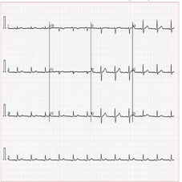 | 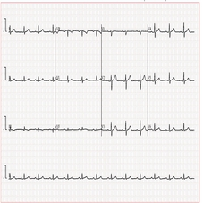 | 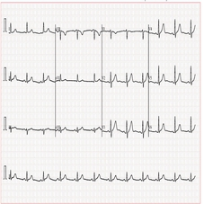 | 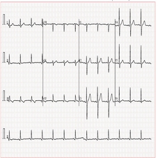 |

| Infarto | Infarto | Infarto | Infarto |
|:---:|:---:|:---:|:---:|
| 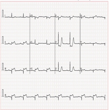 | 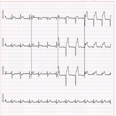 | 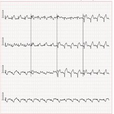 | 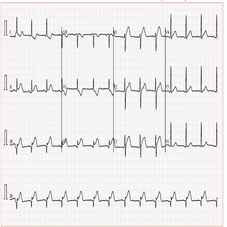 |

Para tornar visível o que a resolução de entrega custa, os dois exames abaixo são da coleção de alta resolução do mesmo mirror, com as 12 derivações rotuladas sobre grade calibrada. Estão em [`assets/amostras/alta_resolucao/`](assets/amostras/alta_resolucao/) e **não** integram o corpus entregue — a justificativa está na seção seguinte.

<p align="center">
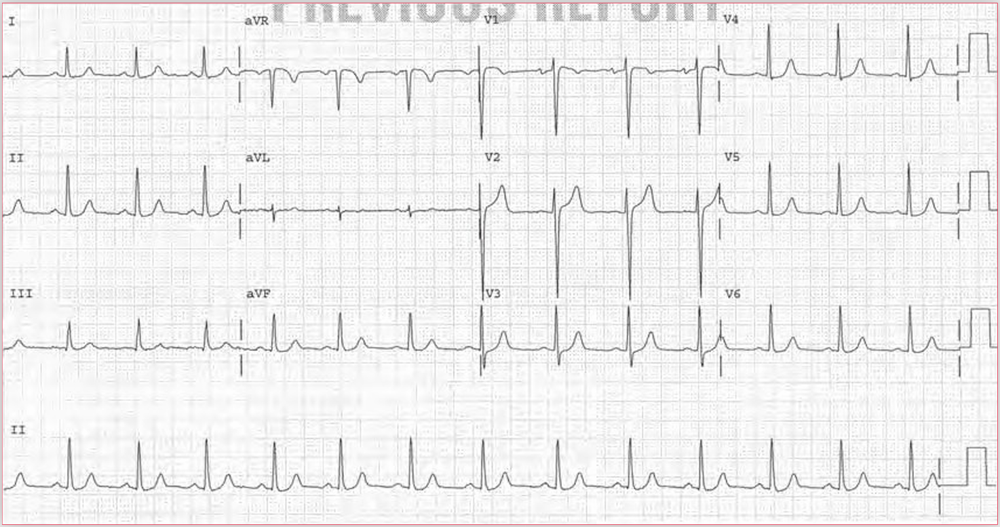<br>
<em>Exame normal completo, 1474×778 px — 12 derivações legíveis.</em>
</p>

<p align="center">
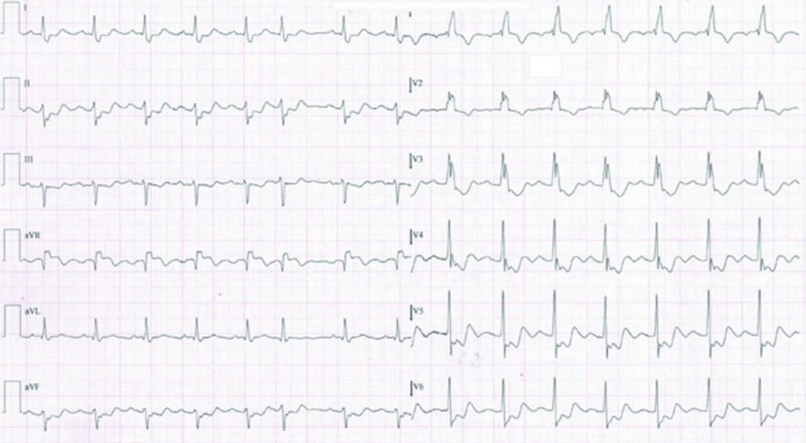<br>
<em>Exame com infarto do miocárdio, 1369×754 px.</em>
</p>

### 3 técnicas de Visão Computacional previstas e o porquê clínico

1. **Classificação por CNN.** A imagem é uma matriz 227×227×3 de intensidades 0 a 255. A convolução com *kernels* aprendidos extrai hierarquicamente os padrões que separam um traçado normal de um infartado — bordas e texturas nas primeiras camadas, morfologia do complexo nas profundas. É a família que vai do AlexNet (2012, que saltou cerca de 10 pontos percentuais no ImageNet com ReLU, *dropout* e GPU, e cuja entrada é exatamente 227×227) às ResNets e aos Vision Transformers. É o uso **adequado a esta resolução** e a base do módulo de diagnóstico assistido.
2. **Detecção de região de interesse (Grad-CAM, R-CNN/YOLO).** Classificar não basta: o cardiologista precisa ver **onde** o modelo olhou. Um mapa de ativação que destaca a derivação suspeita transforma o resultado em algo auditável; sem ele, o laudo é veredito sem justificativa — e laudo sem justificativa não é utilizável em saúde, por melhor que seja a métrica.
3. **Pré-processamento por limiarização de Otsu e morfologia.** No ECG digitalizado, o traçado precisa ser separado do papel milimetrado de fundo: Otsu escolhe o limiar automaticamente a partir do histograma, sem constante arbitrária, e a morfologia (abertura e fechamento) remove ruído de digitalização e reconecta segmentos interrompidos. Aplica-se ao **pipeline-alvo em alta resolução**, não a estas 227×227 — ver a limitação declarada a seguir.

### Limitação declarada de resolução

Nos exames em alta resolução as 12 derivações estão rotuladas (I, II, III, aVR, aVL, aVF, V1 a V6) sobre grade calibrada. **A 227×227 os rótulos ficam ilegíveis e a grade não é mensurável.** Consequência honesta: nesta base **não há morfometria** — supradesnivelamento de ST em milímetros, intervalo QT — nem **localização do território do infarto** (anterior, inferior, lateral). Restam textura e forma global da onda, que sustentam classificação, não medida. Duas amostras em alta resolução foram mantidas em [`assets/amostras/alta_resolucao/`](assets/amostras/alta_resolucao/) exatamente para tornar essa perda visível a quem avalia.

### Relevância clínica

O ECG é o exame cardiológico de maior volume e menor custo, e sua leitura depende da disponibilidade de especialista. Um classificador auxiliar **não substitui o cardiologista: reordena a fila**. Em triagem de emergência, adiantar em minutos o reconhecimento de um supradesnivelamento de ST é a diferença entre músculo cardíaco preservado e perdido. Por isso o CardioIA trata a Parte 3 como módulo de **priorização**, com laudo sempre validado por humano.

---

## 🛡️ Governança de Dados e Viés

Esta fase corresponde às etapas de **planejamento** e **aquisição/ingestão** do ciclo de vida de dados (DAMA-DMBOK2). O projeto adota o **NIST AI RMF** (Governar, Mapear, Medir, Gerenciar) como referência de gestão de risco e o **CRISP-DM** como método de condução.

### Caracterização pelos 5 V's

| V | Situação medida nesta fase |
|---|---|
| Volume | 918 registros, 523 imagens, 2 documentos (23.627 caracteres) — escala de prototipagem, não de produção |
| Variedade | Estruturado (CSV), não estruturado textual e não estruturado visual, cada um alimentando um módulo distinto |
| Velocidade | Lote nesta fase; a camada IoT já define o esquema do regime de *streaming* das próximas |
| **Veracidade** | Base clínica de fonte pública auditada; camada simulada **explicitamente sinalizada** em todo lugar, nunca apresentada como real |
| Valor | O valor não está no dado bruto, e sim na adequação clínica — daí a justificativa variável a variável |

### 1. Auditoria de proveniência: o funil de completude

O script baixou a base bruta do UCI e mediu o que sobra quando se exige registro completo ([`data/auditoria_uci.txt`](data/auditoria_uci.txt)):

| Origem | Registros | Sem `?` | % completo |
|---|---|---|---|
| Cleveland (EUA) | 303 | 297 | 98,0% |
| Hungarian (Hungria) | 294 | 1 | 0,3% |
| Switzerland (Suíça) | 123 | 0 | 0,0% |
| VA Long Beach (EUA) | 200 | 1 | 0,5% |
| **Total** | **920** | **299** | **32,5%** |

Ausências por variável: `ca` 66,4%, `thal` 52,8%, `slope` 33,6%, `fbs` 9,8%, `oldpeak` 6,7%.

**Leitura crítica:** um `dropna()` ingênuo descartaria 67,5% da base e — pior — deixaria o dataset **quase inteiramente composto por pacientes de Cleveland**, convertendo um problema de dados faltantes em viés geográfico silencioso. A política adotada foi a inversa: usar a consolidação de 918 registros, que retém as quatro origens ao custo de trabalhar com menos variáveis, e **declarar a limitação em vez de escondê-la sob uma taxa de completude artificialmente alta**.

### 2. Viés de sexo: números reais desta base

| Sexo | Pacientes | % da base | Casos positivos | Prevalência |
|---|---|---|---|---|
| Masculino | 725 | 79,0% | 458 | **63,2%** |
| Feminino | 193 | 21,0% | 50 | **25,9%** |
| Total | 918 | 100% | 508 | 55,3% |

Mulheres são **um quinto da base** e apresentam prevalência **2,4 vezes menor**. Duas causas se somam e não podem ser separadas com estes dados: sub-representação na coleta e o fato clínico conhecido de que **o infarto em mulheres se manifesta com sintomatologia distinta e é historicamente subdiagnosticado**. Ou seja, parte do "menor risco" observado pode ser diagnóstico que não foi feito.

**Consequência operacional:** um classificador treinado sem correção otimizará a acurácia agregada acertando homens. Nas fases seguintes exige-se (a) reponderação de classes ou coleta dirigida, (b) avaliação de métricas **por subgrupo**, nunca só no agregado, e (c) limiar de decisão calibrado separadamente por sexo.

### 3. Ausência codificada como zero: a armadilha mais perigosa desta base

`Cholesterol = 0` aparece em **172 dos 918 registros (18,7%)**. Colesterol sérico zero é fisiologicamente impossível: é **ausência de medição gravada como valor**. E o efeito é mensurável:

| Grupo | N | Prevalência de `HeartDisease` |
|---|---|---|
| `Cholesterol = 0` | 172 | **88,4%** |
| `Cholesterol > 0` | 746 | 47,7% |

O zero **prediz a doença melhor que o colesterol real** — porque não codifica fisiologia, e sim o contexto de coleta (a base suíça, com 123 de 123 pacientes sem colesterol medido, é de perfil mais grave). Um modelo treinado sem tratamento aprenderia o **atalho**: "sem colesterol medido, logo doente". Teria alta acurácia no teste e falharia em produção no primeiro hospital que preenche o campo corretamente. É o caso-escola de vazamento de dados por padrão de ausência.

A distribuição do zero por sexo é 161 homens e 11 mulheres — o defeito não é uniforme e interage com o viés do item anterior. `RestingBP = 0` ocorre em 1 registro pelo mesmo mecanismo. **Ambos permanecem no CSV entregue, sinalizados aqui e no dicionário de variáveis**, porque apagá-los silenciosamente destruiria a evidência da própria falha de qualidade que a governança precisa registrar. O tratamento (imputação com indicador de ausência) é decisão da fase de modelagem e será documentado lá.

### 4. Casos históricos de viés algorítmico e o que fizemos por causa deles

- **Obermeyer et al. (2019), *Science*** — um algoritmo de gestão de cuidado usado em larga escala nos EUA adotou **gasto médico prévio como proxy de necessidade de saúde**. Como pacientes negros historicamente recebiam menos tratamento, gastavam menos, e o modelo concluiu que precisavam de menos cuidado: cerca de **17%** dos que deveriam ser priorizados ficaram de fora. O erro não estava no código, estava na **escolha da variável**. Aplicação direta aqui: todas as variáveis desta base são **fisiológicas ou de exame** (pressão, colesterol, ST, HRV) e **nenhum proxy socioeconômico ou de utilização de serviço entra como preditor**. O item 3 acima é a versão local desse mesmo erro, encontrada porque foi procurada.
- **Amazon (viés detectado em 2015, revelado pela Reuters em 2018)** — dez anos de currículos majoritariamente masculinos ensinaram o modelo de recrutamento a penalizar o termo "feminino". A lição é que **um histórico desequilibrado vira regra de decisão**. É exatamente a situação do item 2: 79% de homens nesta base. Por isso a distribuição por sexo é impressa pelo próprio script de preparação a cada execução, e não apurada uma única vez.

### 5. Viés geográfico entre as três camadas

| Camada | População de origem |
|---|---|
| Numérica | EUA e Europa (Cleveland, Hungria, Suíça, VA Long Beach) |
| Textual | Brasil (SciELO/UFMG e Ministério da Saúde) |
| Visual | **Paquistão** — centro único (Ch. Pervaiz Elahi Institute of Cardiology, Multan) |

Equipamento, protocolo de aquisição e perfil de paciente diferem entre as três. Além disso, o corpus visual vem de **um único centro**: o modelo pode aprender a assinatura do aparelho daquele hospital em vez da patologia. **Nenhum modelo treinado sobre estes dados pode ser apresentado como validado para a população brasileira sem recalibração em dados locais** — e a validação externa em outro centro é requisito, não refinamento.

### 6. LGPD, explicabilidade e ciclo de vida

- **LGPD e GDPR** — nenhum dado pessoal identificável foi utilizado. A base clínica já é anonimizada na origem, os identificadores são pseudônimos sequenciais e a telemetria é sintética. Dados de saúde são **dados sensíveis** (art. 5º, II da LGPD): anonimização aqui é requisito legal, não boa prática opcional.
- **Explicabilidade** — o módulo de diagnóstico deverá expor LIME/SHAP para atribuição de importância nas variáveis e Grad-CAM nas imagens. O paradoxo da explicabilidade é real (os modelos mais precisos tendem a ser os menos interpretáveis), mas em saúde um laudo que ninguém consegue justificar não é utilizável, por mais alta que seja a métrica.
- **Model drift** — perfil epidemiológico e protocolos clínicos mudam (*data drift* e *concept drift*). Esta base não é definitiva: é ponto de partida versionado e revisitável.
- **Licenças verificadas nas três camadas** — base numérica sob **ODbL 1.0**, texto técnico sob **CC-BY**, imagens sob **CC-BY 4.0** (rastreada até a fonte primária, já que o mirror não declara nenhuma) e o texto do Ministério da Saúde como conteúdo público federal. Todas conferidas na origem em 20/08/2026, não presumidas. Este repositório redistribui dados de terceiros: verificar licença antes de publicar é obrigação legal, não zelo excessivo.
- **Rastreabilidade** — origem, licença, data de acesso e transformação de cada base estão registradas neste README, em [`docs/FONTES.md`](docs/FONTES.md), em `data/auditoria_uci.txt` e em `data/inventario_imagens.csv`. Os dois scripts são idempotentes e de semente fixa: qualquer pessoa reproduz os mesmos arquivos. *Garbage in, garbage out* — nenhum modelo das fases seguintes será melhor que a curadoria feita aqui.

---

## 🚀 Como as próximas fases usarão estes dados

| Fase | Uso previsto | Insumo desta entrega |
|---|---|---|
| Machine Learning | Classificador de risco cardiovascular, avaliado por subgrupo de sexo | `data/cardioia_dataset.csv` |
| NLP / Chatbot | Extração de sintomas e triagem conversacional em dois registros linguísticos | `docs/*.txt` |
| Visão Computacional | CNN de apoio ao laudo com Grad-CAM, sobre o split de origem preservado | `assets/ecg/` |
| IoT | Ingestão via MQTT (QoS maior ou igual a 1) da telemetria cujo esquema foi definido na Parte 1 | `spo2_pct`, `hrv_sdnn_ms`, `temp_corporal_c` |
| Agentes e Governança | Orquestração dos módulos com auditoria de viés e explicabilidade contínuas | Esta seção de Governança |

## 🗃 Modelo de Dados

O `cardioia_dataset.csv` é entregue achatado — uma linha por paciente, como exigem as bibliotecas de Machine Learning. Conceitualmente, porém, ele reúne **três entidades de origens distintas**, e o diagrama abaixo torna essa separação explícita: `PACIENTE` e `EXAME_CLINICO` vêm da base clínica **real**; `TELEMETRIA_IOT` é a camada **simulada**, gerada com semente fixa e assim rotulada em todo o projeto.

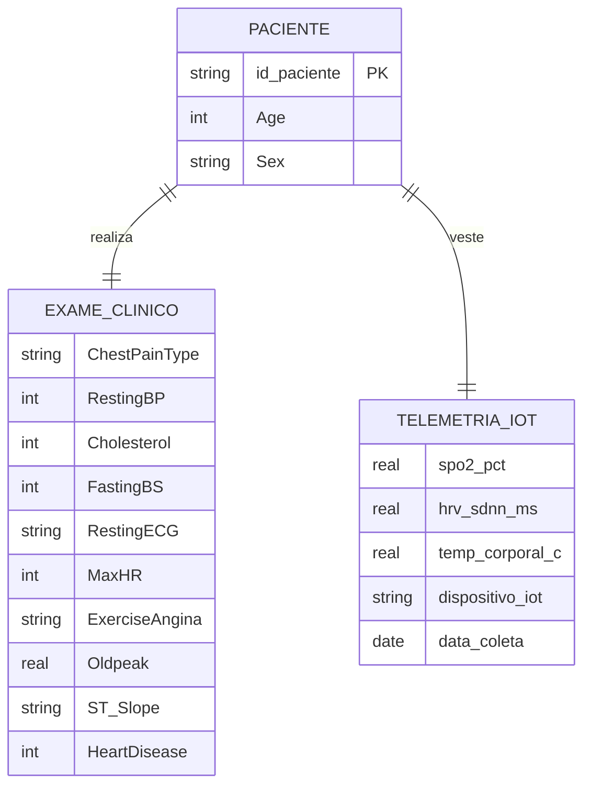

A cardinalidade `1:1` é uma **limitação declarada desta fase**, não uma escolha de modelagem: a base clínica traz um único exame por paciente e a telemetria foi simulada como leitura agregada. Na arquitetura-alvo do CardioIA, `TELEMETRIA_IOT` vira `1:N` — um fluxo contínuo de leituras por paciente ao longo do tempo, com `data_coleta` promovida a chave temporal e as séries alimentando os modelos de detecção de deterioração descritos na seção anterior.

As camadas textual e visual não entram no diagrama porque não são relacionais: o corpus de PLN são dois documentos e o corpus de ECG são arquivos rotulados por pasta. A chave que um dia unirá as três é `id_paciente`, hoje sintética e sem vínculo com as imagens — ligá-las exigiria uma base em que exame de imagem e prontuário viessem do mesmo indivíduo, o que nenhuma das fontes públicas usadas oferece.

## 📚 Fontes

Todas acessadas e verificadas em **20/08/2026**. Detalhamento completo em [`docs/FONTES.md`](docs/FONTES.md).

- **Base numérica** — fedesoriano. *Heart Failure Prediction Dataset*. Kaggle. https://www.kaggle.com/datasets/fedesoriano/heart-failure-prediction — ODbL 1.0, http://opendatacommons.org/licenses/odbl/1.0/
- **Base numérica, origem primária** — Janosi, A.; Steinbrunn, W.; Pfisterer, M.; Detrano, R. *Heart Disease*. UCI Machine Learning Repository, 1989. https://archive.ics.uci.edu/dataset/45/heart+disease
- **Texto técnico** — Santana Júnior, W. B. *et al.* *Uso da Inteligência Artificial Aplicada ao Eletrocardiograma para Diagnóstico de Disfunção Sistólica Ventricular Esquerda*. Arq. Bras. Cardiol., 122(4):e20240740, 2025. CC-BY. https://doi.org/10.36660/abc.20240740
- **Texto leigo** — Ministério da Saúde. *Infarto*. Portal gov.br, Saúde de A a Z. https://www.gov.br/saude/pt-br/assuntos/saude-de-a-a-z/i/infarto
- **Imagens** — Khan, Ali Haider. *ECG Images dataset of Cardiac Patients*. Mendeley Data, 2021. CC-BY 4.0. https://doi.org/10.17632/gwbz3fsgp8.2 — obtidas via mirror https://huggingface.co/datasets/Amarsaish/ecg_images
- Obermeyer, Z.; Powers, B.; Vogeli, C.; Mullainathan, S. *Dissecting racial bias in an algorithm used to manage the health of populations*. Science, 366(6464):447-453, 2019.
- Reuters. *Amazon scraps secret AI recruiting tool that showed bias against women*. 10 out. 2018.

## 🗃 Histórico de lançamentos

* 1.1.0 - 22/08/2026
    * Amostras do corpus visual e exames em alta resolução embutidos no README, seção de Modelo de Dados, seção de execução dos scripts e `docs/requirements.txt`.
* 1.0.0 - 20/08/2026
    * Entrega da Fase 1: base numérica (918×18), corpus textual (dois registros linguísticos) e corpus visual (523 ECGs), com justificativa clínica por variável e camada de governança com viés medido.

## 📋 Licença

<p xmlns:cc="http://creativecommons.org/ns#" xmlns:dct="http://purl.org/dc/terms/"><a property="dct:title" rel="cc:attributionURL" href="https://github.com/agodoi/template">MODELO GIT FIAP</a> por <a rel="cc:attributionURL dct:creator" property="cc:attributionName" href="https://fiap.com.br">Fiap</a> está licenciado sobre <a href="http://creativecommons.org/licenses/by/4.0/?ref=chooser-v1" target="_blank" rel="license noopener noreferrer" style="display:inline-block;">Attribution 4.0 International</a>.</p>
